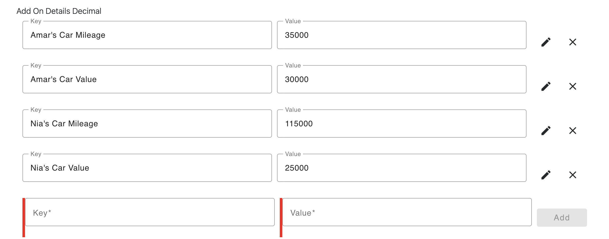
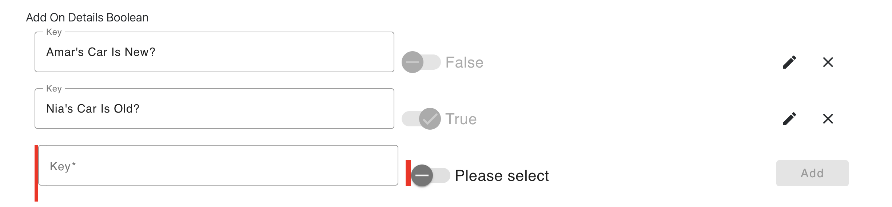
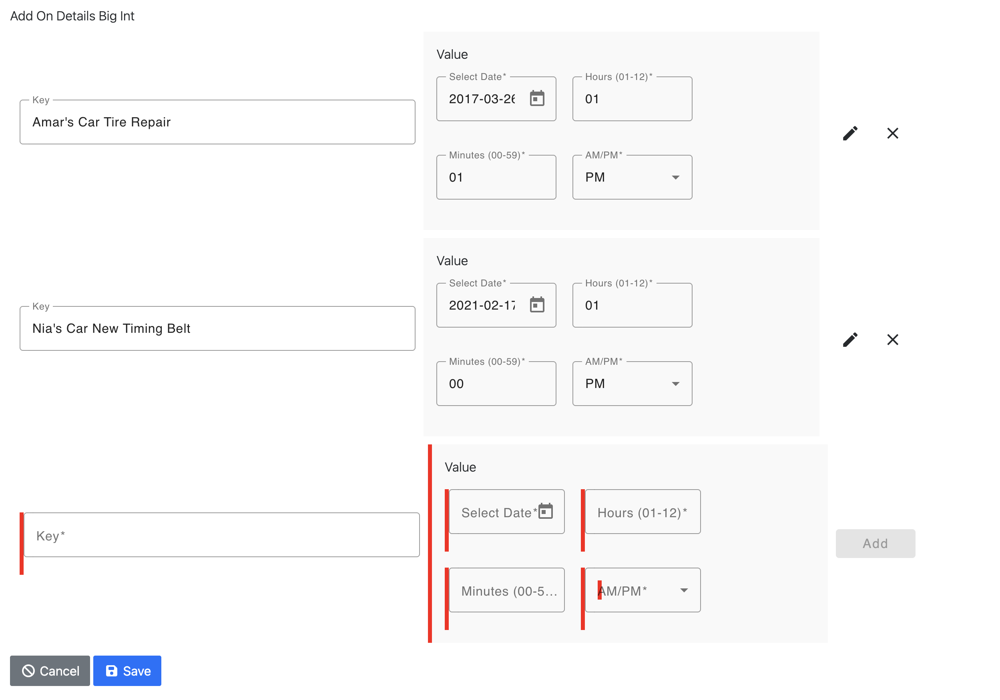

# generator-jhipster-cassandra

> A JHipster blueprint for Cassandra with advanced support for composite primary keys, sets, and maps. Compatible with JHipster v9.0.0.

## Introduction

This is a [JHipster](https://www.jhipster.tech/) blueprint designed to extend JHipster’s capabilities to support **Apache Cassandra**, particularly with **composite primary keys**, `SET`, and `MAP` types.

The `generator-jhipster-cassandra` blueprint provides powerful schema modeling tools tailored for Cassandra, including fine-grained control over **partition** and **clustering** keys, along with native support for complex Cassandra collections like **sets** and **maps**.

---

## 🔑 Key Features

- **Composite Primary Key Support**
  - Define entities with multiple primary key fields.
  - Use `@customAnnotation("PrimaryKeyType.PARTITIONED")` and `@customAnnotation("PrimaryKeyType.CLUSTERED")` to clearly specify partition and clustering columns.
  - Auto-generate query methods for equality, range, and filtering on clustering columns.

- **Set & Map Field Support**
  - Native Cassandra collection types are now fully supported:
    - `CassandraType.Name.SET`
	  - Supports `TEXT`
    - `CassandraType.Name.MAP`
      - Supports various key-value types: `TEXT`, `BOOLEAN`, `DECIMAL`, and `BIGINT`.

- **AI-Powered Semantic Vector Search**
  - Define vector embedding fields using `@customAnnotation("VECTOR")` with configurable dimensions.
  - Automatic AI search bar on entity list pages with semantic similarity search.
  - Checkbox selection to search across one or more vector fields when an entity has multiple embeddings.
  - Uses Cassandra 5.0+ SAI (Storage Attached Indexes) with ANN (Approximate Nearest Neighbor) queries.
  - Powered by Spring AI with OpenAI embeddings (text-embedding-3-small model, 1536 dimensions).
  - Auto-generates `EmbeddingService`, `EmbeddingConfiguration`, repository ANN query methods, and REST endpoints.

- **Custom Annotations**
  - Annotations like `@customAnnotation("UTC_DATE")` or `@customAnnotation("TIMEUUID")` support consistent metadata across entity fields.

- **Optimized for Microservices**
  - Seamless integration with the JHipster microservice architecture.
  - Supports JDL files with complex schemas.

---

## Improvements Since v1.0.15

The following improvements have been made since the last open-source tagged release (v1.0.15):

### Cassandra Pagination Overhaul
- Replaced page-number-based pagination with native **Cassandra Slice pagination** using paging state tokens, which is the correct approach for Cassandra's distributed architecture.
- Added a dedicated `/slice` endpoint for backward-compatible paginated queries.
- Replaced automatic infinite scroll with a **Load More button** for better UX control.
- Fixed paging state extraction to use `CassandraPageRequest` with the correct public API.
- Fixed infinite "Load More" loop by properly checking for empty results.

### Composite Key Search Widget
- Added **findBy search methods** for Cassandra composite keys with a full search widget on entity list pages.
- Added **date pickers and comparison operators** (equals, greater than, less than, etc.) for clustering key fields.
- Clustering key fields are **automatically disabled** when an inequality operator is selected on a preceding clustering column (respecting Cassandra's query restrictions).
- Navbar entities are now **sorted alphabetically** for easier navigation.

### UTC Date Handling
- Added `UTC_DATE` display support that prevents timezone shifting -- dates are rendered exactly as stored.
- Added a custom `FormatUtcDatePipe` for consistent date-only formatting in Angular templates.
- Fixed UTC_DATE form handling to use dayjs throughout the stack (create, update, and search forms).
- Configured `DayjsDateAdapter` for Material Datepicker integration.

### Composite Key Sorting
- Added **column sorting** for Cassandra entities, with proper data array clearing when sort changes.
- Sort by composite key fields is now fully supported in the Angular list view.

### Backend Fixes
- Fixed malformed CQL `@Query` generation in `findLatestBy` repository methods.
- Removed expensive `count()` queries from Cassandra resource templates (not supported efficiently by Cassandra).
- Fixed Cassandra pagination to use an explicit `pagingState` query parameter for clean API design.
- Improved translation key generation for Cassandra entities using i18n entity labels.

---

## 🧑‍💻 Example Use Cases

- Model a `Post` entity using a composite primary key (`createdDate`, `addedDateTime`, `postId`) and additional attributes like `title` and `content`.
- Use `SET` to tag entities with multiple string values.
- Use `MAP` to represent dynamic metadata or key-value configurations (e.g., `addOnDetailsBoolean`, `addOnDetailsDecimal`).
- Define a `Tag` entity with AI-powered semantic search across `name` and `description` fields using vector embeddings.

---

## 🧪 JDL Examples

### Composite Key Example

Below are various examples of defining JDL entities using the @customAnnotation methodology to specify the details of the Cassandra composite primary key. Also, below is an example of a single-value primary key entity. Some example entities are of composite primary keys using Map fields and some are using a Set field. There are also examples of single-value primary key entities using Maps and Set data structures.
```
    // Composite Primary Key Example:
    entity Post {
      @Id @customAnnotation("PrimaryKeyType.PARTITIONED") @customAnnotation("CassandraType.Name.BIGINT") @customAnnotation("UTC_DATE") @customAnnotation("0") createdDate Long 
      // Do not name composite primary key fields as 'id' as it conflicts with the 'id' field in the JHipster entity.
      @customAnnotation("PrimaryKeyType.CLUSTERED") @customAnnotation("CassandraType.Name.BIGINT") @customAnnotation("UTC_DATETIME") @customAnnotation("1") addedDateTime Long
      @customAnnotation("PrimaryKeyType.CLUSTERED") @customAnnotation("CassandraType.Name.UUID") @customAnnotation("") @customAnnotation("2") postId UUID
      @customAnnotation("") @customAnnotation("CassandraType.Name.TEXT") @customAnnotation("") @customAnnotation("") title String required
      @customAnnotation("") @customAnnotation("CassandraType.Name.TEXT") @customAnnotation("") @customAnnotation("") content String required
      @customAnnotation("") @customAnnotation("CassandraType.Name.BIGINT") @customAnnotation("UTC_DATETIME") @customAnnotation("") publishedDateTime Long
      @customAnnotation("") @customAnnotation("CassandraType.Name.BIGINT") @customAnnotation("UTC_DATE") @customAnnotation("") sentDate Long
    }

    // Single-value Primary Key Example:
    entity Product {
      // Primary Key field can be named 'id'.  JHipster natively supports single-value primary keys.  This blueprint also supports single-value primary keys.
      @Id @customAnnotation("PrimaryKeyType.PARTITIONED") @customAnnotation("CassandraType.Name.UUID") @customAnnotation("") @customAnnotation("") id UUID
      @customAnnotation("") @customAnnotation("CassandraType.Name.TEXT") @customAnnotation("") @customAnnotation("") title String required
      @customAnnotation("") @customAnnotation("CassandraType.Name.DECIMAL") @customAnnotation("") @customAnnotation("") price BigDecimal required min(0)
      @customAnnotation("") @customAnnotation("CassandraType.Name.BLOB") @customAnnotation("image") @customAnnotation("") image ImageBlob
      @customAnnotation("") @customAnnotation("CassandraType.Name.BIGINT") @customAnnotation("UTC_DATE") @customAnnotation("") addedDate Long required
    }

    // Composite Primary Key Example with TIMEUUID clustered key, multiple partitioned keys, with multiple clustered keys.
    entity SaathratriEntity2 {
      @Id @customAnnotation("PrimaryKeyType.PARTITIONED") @customAnnotation("CassandraType.Name.UUID") @customAnnotation("") entityTypeId UUID
      @customAnnotation("PrimaryKeyType.PARTITIONED") @customAnnotation("CassandraType.Name.BIGINT") @customAnnotation("") yearOfDateAdded Long
      @customAnnotation("PrimaryKeyType.CLUSTERED") @customAnnotation("CassandraType.Name.BIGINT") @customAnnotation("UTC_DATE") arrivalDate Long
      @customAnnotation("PrimaryKeyType.CLUSTERED") @customAnnotation("CassandraType.Name.TIMEUUID") @customAnnotation("TIMEUUID") blogId UUID
      @customAnnotation("") @customAnnotation("CassandraType.Name.TEXT") @customAnnotation("") entityName String
      @customAnnotation("") @customAnnotation("CassandraType.Name.TEXT") @customAnnotation("") entityDescription String
      @customAnnotation("") @customAnnotation("CassandraType.Name.DECIMAL") @customAnnotation("") entityCost BigDecimal
      @customAnnotation("") @customAnnotation("CassandraType.Name.BIGINT") @customAnnotation("UTC_DATE") departureDate Long
    }

    // Example showing a text/string set.
    entity SaathratriEntity3 {
      @Id @customAnnotation("PrimaryKeyType.PARTITIONED") @customAnnotation("CassandraType.Name.TEXT") @customAnnotation("") entityType String
      @customAnnotation("PrimaryKeyType.CLUSTERED") @customAnnotation("CassandraType.Name.TIMEUUID") @customAnnotation("") createdTimeId UUID
      @customAnnotation("") @customAnnotation("CassandraType.Name.TEXT") @customAnnotation("") entityName String
      @customAnnotation("") @customAnnotation("CassandraType.Name.TEXT") @customAnnotation("") entityDescription String
      @customAnnotation("") @customAnnotation("CassandraType.Name.DECIMAL") @customAnnotation("") entityCost BigDecimal
      @customAnnotation("") @customAnnotation("CassandraType.Name.BIGINT") @customAnnotation("UTC_DATE") departureDate Long
      @customAnnotation("CassandraType.Name.SET") @customAnnotation("CassandraType.Name.TEXT") @customAnnotation("") tags String,
    }

    // Example showing key-value data structure.
    entity SaathratriEntity4 {
      @Id @customAnnotation("PrimaryKeyType.PARTITIONED") @customAnnotation("CassandraType.Name.UUID") @customAnnotation("") organizationId UUID
      @customAnnotation("PrimaryKeyType.CLUSTERED") @customAnnotation("CassandraType.Name.TEXT") @customAnnotation("") attributeKey String
      @customAnnotation("") @customAnnotation("CassandraType.Name.TEXT") @customAnnotation("") attributeValue String
    }

        // Example showing text/string, boolean, numeric and date-time maps.
    entity AddOnsAvailableByOrganization {
      @Id @customAnnotation("PrimaryKeyType.PARTITIONED") @customAnnotation("CassandraType.Name.UUID") @customAnnotation("") organizationId UUID
      @customAnnotation("PrimaryKeyType.PARTITIONED") @customAnnotation("CassandraType.Name.TEXT") @customAnnotation("") entityType String
      @customAnnotation("PrimaryKeyType.PARTITIONED") @customAnnotation("CassandraType.Name.UUID") @customAnnotation("") entityId UUID
      @customAnnotation("PrimaryKeyType.CLUSTERED") @customAnnotation("CassandraType.Name.UUID") @customAnnotation("") addOnId UUID
      @customAnnotation("") @customAnnotation("CassandraType.Name.TEXT") @customAnnotation("") addOnType String
      @customAnnotation("CassandraType.Name.MAP") @customAnnotation("CassandraType.Name.TEXT") @customAnnotation("") addOnDetailsText String
      @customAnnotation("CassandraType.Name.MAP") @customAnnotation("CassandraType.Name.DECIMAL") @customAnnotation("") addOnDetailsDecimal BigDecimal
      @customAnnotation("CassandraType.Name.MAP") @customAnnotation("CassandraType.Name.BOOLEAN") @customAnnotation("") addOnDetailsBoolean Boolean
      @customAnnotation("CassandraType.Name.MAP") @customAnnotation("CassandraType.Name.BIGINT") @customAnnotation("UTC_DATETIME") addOnDetailsBigInt Long
    }

    // Another example showing text/string, boolean, numeric and date-time maps.
    entity AddOnsSelectedByOrganization {
      @Id @customAnnotation("PrimaryKeyType.PARTITIONED") @customAnnotation("CassandraType.Name.UUID") @customAnnotation("") organizationId UUID
      @customAnnotation("PrimaryKeyType.CLUSTERED") @customAnnotation("CassandraType.Name.BIGINT") @customAnnotation("UTC_DATE") arrivalDate Long
      @customAnnotation("PrimaryKeyType.CLUSTERED") @customAnnotation("CassandraType.Name.TEXT") @customAnnotation("") accountNumber String
      @customAnnotation("PrimaryKeyType.CLUSTERED") @customAnnotation("CassandraType.Name.TIMEUUID") @customAnnotation("") createdTimeId UUID
      @customAnnotation("") @customAnnotation("CassandraType.Name.BIGINT") @customAnnotation("UTC_DATE") departureDate Long
      @customAnnotation("") @customAnnotation("CassandraType.Name.UUID") @customAnnotation("") customerId UUID
      @customAnnotation("") @customAnnotation("CassandraType.Name.TEXT") @customAnnotation("") customerFirstName String
      @customAnnotation("") @customAnnotation("CassandraType.Name.TEXT") @customAnnotation("") customerLastName String
      @customAnnotation("") @customAnnotation("CassandraType.Name.TEXT") @customAnnotation("") customerUpdatedEmail String
      @customAnnotation("") @customAnnotation("CassandraType.Name.TEXT") @customAnnotation("") customerUpdatedPhoneNumber String
      @customAnnotation("") @customAnnotation("CassandraType.Name.TEXT") @customAnnotation("") customerEstimatedArrivalTime String
      @customAnnotation("") @customAnnotation("CassandraType.Name.TEXT") @customAnnotation("") tinyUrlShortCode String
      @customAnnotation("CassandraType.Name.MAP") @customAnnotation("CassandraType.Name.TEXT") @customAnnotation("") addOnDetailsText String
      @customAnnotation("CassandraType.Name.MAP") @customAnnotation("CassandraType.Name.DECIMAL") @customAnnotation("") addOnDetailsDecimal BigDecimal
      @customAnnotation("CassandraType.Name.MAP") @customAnnotation("CassandraType.Name.BOOLEAN") @customAnnotation("") addOnDetailsBoolean Boolean
      @customAnnotation("CassandraType.Name.MAP") @customAnnotation("CassandraType.Name.BIGINT") @customAnnotation("UTC_DATETIME") addOnDetailsBigInt Long
    }

    // Single-value Primary Key with Maps
    entity LandingPageByOrganization {
      @Id @customAnnotation("PrimaryKeyType.PARTITIONED") @customAnnotation("CassandraType.Name.UUID") @customAnnotation("") organizationId UUID
      @customAnnotation("CassandraType.Name.MAP") @customAnnotation("CassandraType.Name.TEXT") @customAnnotation("") detailsText String
      @customAnnotation("CassandraType.Name.MAP") @customAnnotation("CassandraType.Name.DECIMAL") @customAnnotation("") detailsDecimal BigDecimal
      @customAnnotation("CassandraType.Name.MAP") @customAnnotation("CassandraType.Name.BOOLEAN") @customAnnotation("") detailsBoolean Boolean
      @customAnnotation("CassandraType.Name.MAP") @customAnnotation("CassandraType.Name.BIGINT") @customAnnotation("UTC_DATETIME") detailsBigInt Long
    }

    // Single-value Primary Key with Set
    entity SetEntityByOrganization {
      @Id @customAnnotation("PrimaryKeyType.PARTITIONED") @customAnnotation("CassandraType.Name.UUID") @customAnnotation("") organizationId UUID
      @customAnnotation("CassandraType.Name.SET") @customAnnotation("CassandraType.Name.TEXT") @customAnnotation("") tags String
    }

    // AI Semantic Search Example with Vector Embeddings:
    // The Tag entity demonstrates AI-powered semantic search with multiple vector fields.
    // Each VECTOR field stores an embedding generated from a source text field.
    // The field name convention is: <sourceFieldName>Embedding (e.g., nameEmbedding derives from name).
    entity Tag {
      @Id @customAnnotation("PrimaryKeyType.PARTITIONED") @customAnnotation("CassandraType.Name.UUID") @customAnnotation("") @customAnnotation("") id UUID
      @customAnnotation("") @customAnnotation("CassandraType.Name.TEXT") @customAnnotation("") @customAnnotation("") name String required
      @customAnnotation("") @customAnnotation("CassandraType.Name.TEXT") @customAnnotation("") @customAnnotation("") description String
      @customAnnotation("VECTOR") @customAnnotation("1536") @customAnnotation("") @customAnnotation("") nameEmbedding Blob
      @customAnnotation("VECTOR") @customAnnotation("1536") @customAnnotation("") @customAnnotation("") descriptionEmbedding Blob
    }
```

**Vector Field Annotation Format:**
- First annotation: `"VECTOR"` — marks the field as a vector embedding column
- Second annotation: `"1536"` — the vector dimension (1536 for OpenAI text-embedding-3-small)
- Third/fourth annotations: unused (leave as `""`)

The field name must end with `Embedding` (e.g., `nameEmbedding`). The source field is derived by stripping the `Embedding` suffix (e.g., `name`).

When an entity has vector fields, the blueprint automatically generates:
- A `GET /api/<entity>/ai-search?query=...&limit=...&fields=...` REST endpoint
- Cassandra ANN (Approximate Nearest Neighbor) query methods in the repository
- An AI search bar on the Angular list page with checkbox selection for choosing which vector fields to search
- `EmbeddingService` and `EmbeddingConfiguration` for OpenAI integration

---

## MAP Data Type UI Components

The blueprint generates custom Angular UI components for each Cassandra MAP value type. The following screenshots demonstrate the `AddOnsAvailableByOrganization` entity, which uses all four supported MAP types.

### JDL Definition

```jdl
entity AddOnsAvailableByOrganization {
  @Id @customAnnotation("PrimaryKeyType.PARTITIONED") @customAnnotation("CassandraType.Name.UUID") @customAnnotation("") organizationId UUID
  @customAnnotation("PrimaryKeyType.PARTITIONED") @customAnnotation("CassandraType.Name.TEXT") @customAnnotation("") entityType String
  @customAnnotation("PrimaryKeyType.PARTITIONED") @customAnnotation("CassandraType.Name.UUID") @customAnnotation("") entityId UUID
  @customAnnotation("PrimaryKeyType.CLUSTERED") @customAnnotation("CassandraType.Name.UUID") @customAnnotation("") addOnId UUID
  @customAnnotation("") @customAnnotation("CassandraType.Name.TEXT") @customAnnotation("") addOnType String
  @customAnnotation("CassandraType.Name.MAP") @customAnnotation("CassandraType.Name.TEXT") @customAnnotation("") addOnDetailsText String
  @customAnnotation("CassandraType.Name.MAP") @customAnnotation("CassandraType.Name.DECIMAL") @customAnnotation("") addOnDetailsDecimal BigDecimal
  @customAnnotation("CassandraType.Name.MAP") @customAnnotation("CassandraType.Name.BOOLEAN") @customAnnotation("") addOnDetailsBoolean Boolean
  @customAnnotation("CassandraType.Name.MAP") @customAnnotation("CassandraType.Name.BIGINT") @customAnnotation("UTC_DATETIME") addOnDetailsBigInt Long
}
```

### MAP&lt;TEXT, TEXT&gt; — String Key-Value Pairs

Edit string-to-string map entries with inline key and value fields. Each entry can be added, edited, or removed.


### MAP&lt;TEXT, DECIMAL&gt; — Numeric Values

Edit string-to-decimal map entries for numeric data such as mileage, cost, or quantity.



### MAP&lt;TEXT, BOOLEAN&gt; — Boolean Toggle Values

Edit string-to-boolean map entries using toggle switches for true/false values.



### MAP&lt;TEXT, BIGINT&gt; with UTC_DATETIME — Date-Time Values

Edit string-to-datetime map entries with a full date and time picker (date, hours, minutes, AM/PM).



### List Page — All MAP Types Displayed

The list page renders all MAP columns with their key-value pairs displayed inline.


### Detail Page — All MAP Types Displayed

The detail/view page renders all MAP fields with their key-value pairs.


---

### AI Search Setup

To enable AI-powered semantic search, set your OpenAI API key:

```bash
export OPENAI_API_KEY=sk-your-api-key-here
```

Or add to `application-dev.yml`:
```yaml
openai:
  api-key: sk-your-api-key-here
```

**Requirements:** Cassandra 5.0+ (for SAI vector index support).

---

## 🚀 Quick Start

### Prerequisites

- Java 21+
- Node.js 20+
- Docker Desktop
- JHipster 9.0.0

### Installation

```bash
npm install -g generator-jhipster-cassandra
```

### Usage

```bash
jhipster --blueprints cassandra
```

---

## 🎡 Example Project

- Full example repo with Cassandra composite key entities and JDL:
  👉 [https://github.com/amarpatel-xx/jhipster-cassandra-example](https://github.com/amarpatel-xx/jhipster-cassandra-example)

### Generate Code

```bash
git clone https://github.com/amarpatel-xx/jhipster-cassandra-example.git
cd jhipster-cassandra-example
sh saathratri-generate-code-dev-cassandra.sh
```

---

## 🔐 Identity Providers

This blueprint supports Keycloak by default. You can switch to Okta using:

```bash
okta apps create jhipster
```

---

## 🧐 Learn More

- 📘 [Cassandra Data Modeling](https://cassandra.apache.org/doc/latest/data-modeling/)
- 📘 [JHipster Blueprints](https://www.jhipster.tech/modules/creating-a-blueprint/)
- 🧓 [Matt Raible on Micro Frontends](https://auth0.com/blog/micro-frontends-for-java-microservices/)

---

## 👏 Acknowledgements

Huge thanks to:
- [yelhouti](https://github.com/yelhouti)
- [Jeremy Artero](https://www.linkedin.com/in/jeremyartero/)
- [Matt Raible](https://github.com/mraible)
- [Gaël Marziou](https://github.com/gmarziou)
- [Cedrick Lunven](https://www.linkedin.com/in/clunven/)
- [Christophe Borne](https://www.linkedin.com/in/christophe-bornet-bab1193/)
- [Disha Patel](https://www.linkedin.com/in/dishapatel860/)
- [Catherine Guevara](https://www.linkedin.com/in/catherine-guevara-1a5375b1/)

---